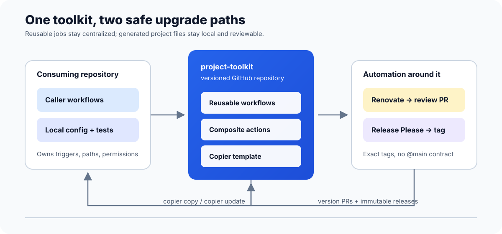

# project-toolkit

> Reusable GitHub Actions workflows and Copier templates for reliable, versioned CI in Python, Node.js, Java, Docker, and polyglot repositories.

[](https://github.com/quokkify/project-toolkit/actions/workflows/copier-fleet-update.yml)



project-toolkit keeps CI implementation in one repository while letting each consuming project own its triggers, paths, permissions, and release policy. It deliberately avoids Git submodules: consumers upgrade through small, reviewable Renovate PRs and template updates.

## What is included?

- **Composite actions** for language setup, Gradle validation, Compose readiness, JUnit summaries, and Allure reports.
- **Copier templates** that create and later update only the small project-local files.
- **Renovate presets and rules** that keep workflow references, action pins, validation tools, and this documentation current.

## Reusable workflows

Call supported workflows from a job with an exact release tag: `uses: quokkify/project-toolkit/.github/workflows/<file>@vX.Y.Z`. The caller still owns triggers, path filters, permissions, and any secrets.

| Workflow | File | Connect from another repository? | Purpose |
| --- | --- | :---: | --- |
| Python CI | [`python-ci.yml`](.github/workflows/python-ci.yml) | Yes | Install dependencies and run configurable lint, test, and optional build commands. |
| Node.js CI | [`node-ci.yml`](.github/workflows/node-ci.yml) | Yes | Install with npm, pnpm, or Yarn and run configurable lint, test, and optional build commands. |
| Java CI | [`java-ci.yml`](.github/workflows/java-ci.yml) | Yes | Build and test Gradle or Maven projects with a selected JDK. |
| Docker build | [`docker-build.yml`](.github/workflows/docker-build.yml) | Yes | Build without pushing by default; optionally authenticate and push an image. |
| Release Please | [`release-please.yml`](.github/workflows/release-please.yml) | Yes | Create release PRs and immutable releases in single-package or manifest mode. |
| Runner detection | [`reusable-detect-runner.yml`](.github/workflows/reusable-detect-runner.yml) | Internal | Select a trusted self-hosted runner for this repository's own validation jobs; it is not a supported consumer API. |

The daily [`Copier fleet audit`](.github/workflows/copier-fleet-update.yml) is repository automation, not a reusable workflow: it checks public Copier-managed consumers for template drift.

## Quick start

Examples use an exact immutable toolkit release reference. Renovate updates these references when a newer release is published.

```yaml
name: CI
on: [pull_request]
permissions:
  contents: read
jobs:
  python:
    uses: quokkify/project-toolkit/.github/workflows/python-ci.yml@v2.10.1
    with:
      python-version: "3.12"
      test-command: pytest
```

Use the independent [`Python`](examples/python-ci.yml), [`Node.js`](examples/node-ci.yml), and [`Java`](examples/java-ci.yml) examples, or compose all three with path filters in the [`polyglot example`](examples/polyglot-ci.yml). Docker builds do not push by default. Copier can opt generated projects into artifact-backed Allure 3 pull-request reports without enabling public Pages. For action-level usage, see [`examples/setup-actions.yml`](examples/setup-actions.yml).

## Documentation

- **[Human guide: create, update, extend, and roll out projects](docs/human-guide.md)**
- [Architecture and researched constraints](docs/architecture.md)
- [Detailed usage, Copier, Release Please, and Renovate](docs/usage.md)
- [Versioning](docs/versioning.md)
- [Security model](docs/security.md)
- [Contributing](CONTRIBUTING.md)

The root [`copier.yml`](copier.yml) points at `templates/project/template/`. Keeping the Copier entry point at the Git root is required for reliable VCS-aware `copier update` operations.

Submodules are intentionally absent: consumers need a stable job API and upgrade PRs, not a second Git history embedded in every project. Production references use exact released versions, never `@main`. Update generated project files with `copier update`; Renovate updates workflow versions in examples and documentation as well as in workflows.

Copier-generated `.github/renovate.json` files extend presets from the central shared repository `quokkify/renovate-presets` by default. Set the `renovate_config_repository` answer to another GitHub `owner/repo` slug to use a different shared preset repository; this answer names the preset repository, not the generated consumer repository. The `renovate_presets` YAML list selects preset names in order: `default` -> `presets/base`, `python` -> `presets/python/default`, `javascript` -> `presets/npm/default`, `java` -> `presets/gradle/default`, `docker` -> `presets/docker/default`, and `github-actions` -> `presets/github-actions/default`. New projects infer `default`, `github-actions`, plus language and Docker presets from Copier answers. Generated extends intentionally follow the preset repository's default branch; projects with stricter stability requirements can manually pin entries later.

## Scope

The toolkit does not deploy to providers, publish language packages, hide project secrets, or generate arbitrary jobs. Validation is static and fixture-based until reusable workflows are available on an accessible Git ref; see the documented limitation in [architecture](docs/architecture.md).

Toolkit composite actions are maintained under `actions/` (setup steps plus Compose readiness) and can be consumed directly by downstream projects. They are independent building blocks for caller-owned jobs; reusable workflows keep their self-contained job implementations so cross-repository calls do not depend on a caller checkout containing toolkit-local actions.
